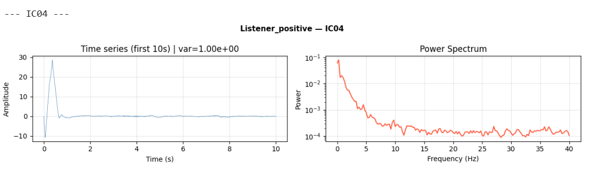
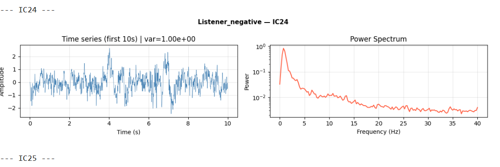
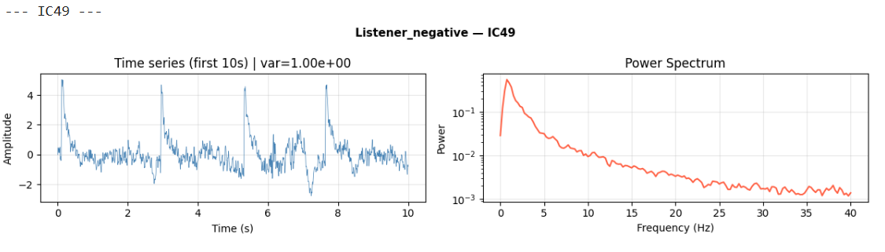
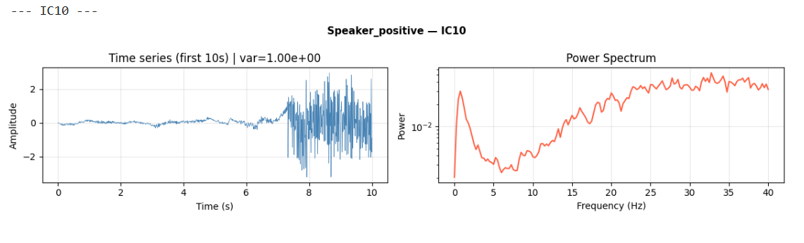
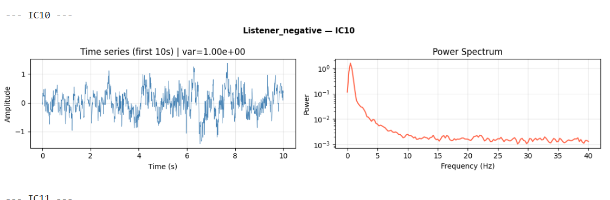
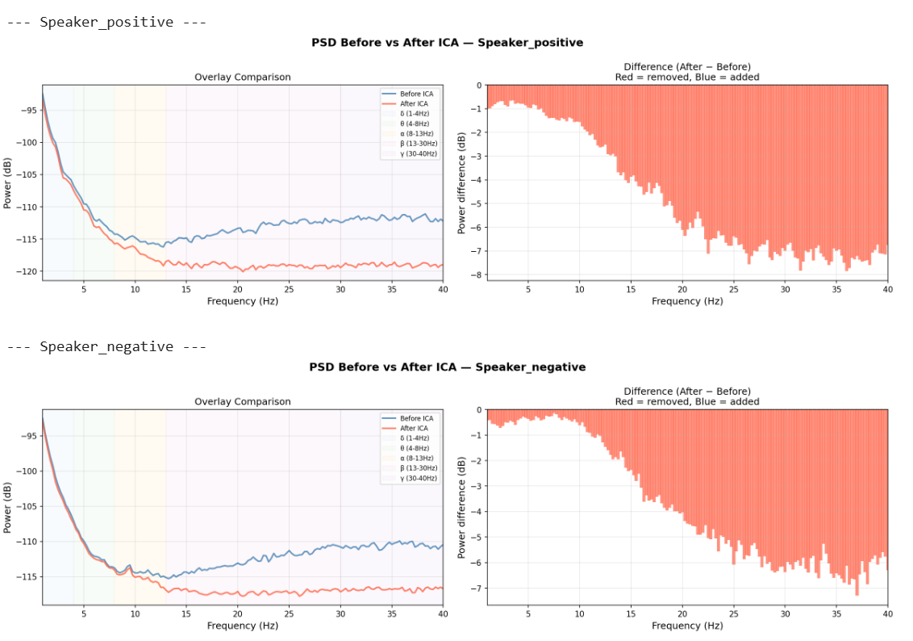
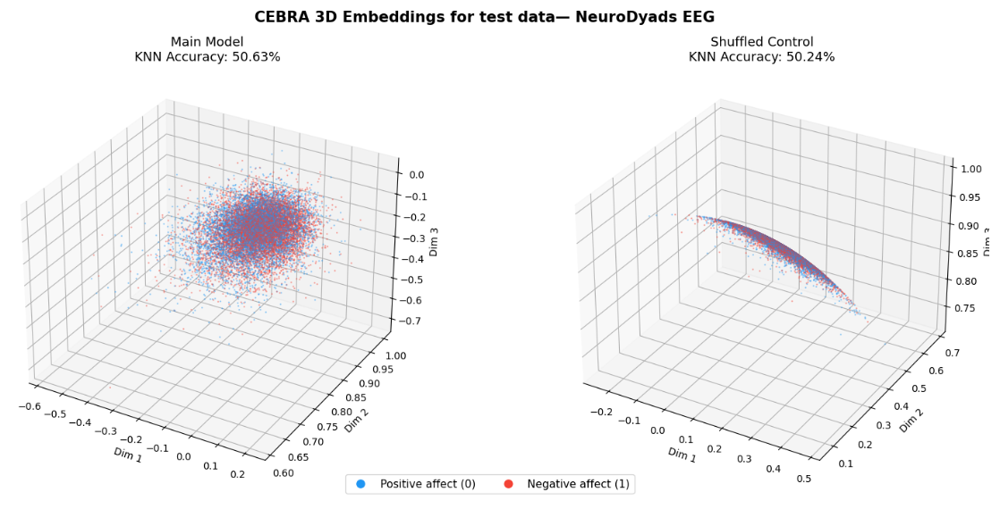
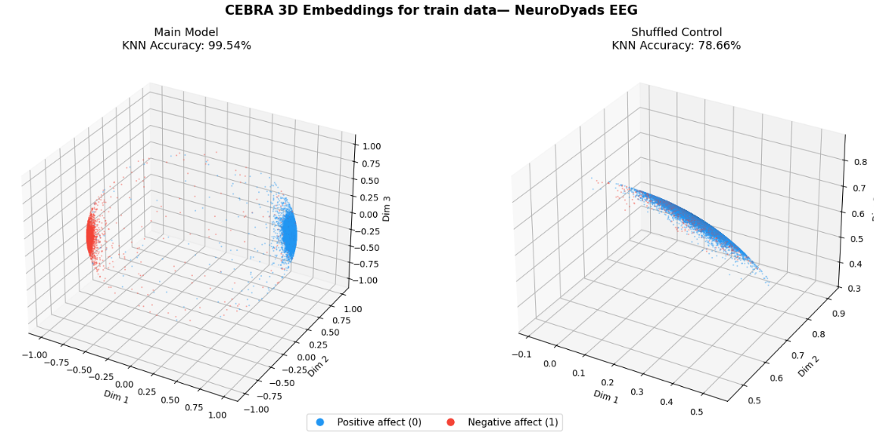
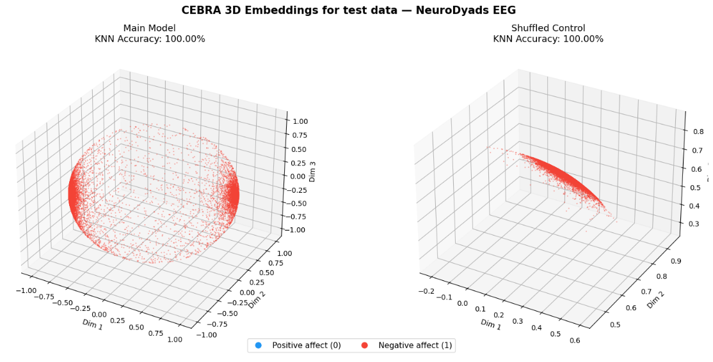

# NeuroDyads GSoC 2026 — Task Report

**Vaidehi Shivram Hegde**  
B.Tech Engineering Physics · IIT (ISM) Dhanbad  
ML4SCI · Google Summer of Code 2026  
Mentors: Dr. Evie Malaia (University of Alabama) · Dr. Brendan Ames (University of Southampton)

---

## Table of Contents

1. [Project Background](#1-project-background)
2. [Task 1 — EEG Preprocessing](#2-task-1--eeg-preprocessing)
   - [Pipeline Overview](#pipeline-overview)
   - [Loading and Cropping](#loading-and-cropping)
   - [Filtering](#filtering)
   - [ICA — Independent Component Analysis](#ica--independent-component-analysis)
   - [ICA Component Decisions](#ica-component-decisions)
   - [PSD Verification](#psd-verification)
   - [Final Output](#final-output)
3. [Task 2 — CEBRA Embedding](#3-task-2--cebra-embedding)
   - [What is CEBRA?](#what-is-cebra)
   - [Data Preparation](#data-preparation)
   - [Model Training](#model-training)
   - [Main Notebook Results](#main-notebook-results)
4. [Three-Experiment Evaluation](#4-three-experiment-evaluation)
   - [Experiment 1 — Transductive (Main Notebook)](#experiment-1--transductive-main-notebook)
   - [Experiment 2 — Random Stratified Split](#experiment-2--random-stratified-split)
   - [Experiment 3 — Chronological Split](#experiment-3--chronological-split)
   - [What the Three Experiments Tell Us Together](#what-the-three-experiments-tell-us-together)
5. [Parts 3 and 4 — Interpretation and Reflection](#5-parts-3-and-4--interpretation-and-reflection)
6. [Problems Encountered and Solutions](#6-problems-encountered-and-solutions)
7. [References](#7-references)

---

## 1. Project Background

NeuroDyads is an ML4SCI project studying **brain-to-brain synchrony** during naturalistic conversation. Two participants — a Listener and a Speaker — wear EEG caps simultaneously while engaging in emotionally varied dialogue. This is called **hyperscanning**: recording neural activity from two brains at the same time.

The scientific question is whether the two participants' brains synchronize in a condition-dependent way — and whether this synchrony carries decodable information about the emotional context of the conversation. The 2025 GSoC pilot (N=8 pairs) showed that CEBRA can decode conversational roles and participant gender at 94% accuracy. The 2026 project scales to 40+ dyads.

This report documents the complete evaluation task: preprocessing two raw EDF recordings from a single dyad, building CEBRA embeddings, and critically evaluating what the results actually mean.

---

## 2. Task 1 — EEG Preprocessing

### Pipeline Overview

```
Raw EDF files (Listener + Speaker)
        ↓
Find DIN1 markers → Crop into 4 segments
        ↓
Remove VREF channel (65 → 64 channels)
        ↓
Rename channels (EEG 1–64 → standard 10-20)
        ↓
Notch filter (60 Hz) + Bandpass filter (1–40 Hz)
        ↓
Fit ICA (Picard, 64 components)
        ↓
Inspect components → Reject artifacts
        ↓
Apply ICA → Save 4 clean .npy files
```

### Loading and Cropping

Both EDF files were loaded using MNE-Python. DIN1 event markers were located programmatically — manual reading introduced crop timing errors. Three markers were found in each file:

| Marker | Listener | Speaker |
|---|---|---|
| DIN1 #1 | 1.00s | 0.79s |
| DIN1 #2 | 148.78s | 148.56s |
| DIN1 #3 | 149.05s | 148.84s |

**Positive affect segment:** marker 1 → marker 2  
**Negative affect segment:** marker 3 → end of file

A 0.22-second duration mismatch was found between the Listener and Speaker negative segments. Both were trimmed to the shorter length to ensure identical time coverage before concatenation.

**Positive segments matched exactly — no trimming needed.**

### Filtering

The raw PSD was plotted before filtering to confirm the source of interference. A sharp peak at 60 Hz confirmed North American power line noise. Two filters were applied sequentially:

1. **60 Hz notch filter** — removes power line interference
2. **1–40 Hz bandpass filter** — preserves biologically relevant EEG oscillations (delta through gamma), removes DC drift below 1 Hz and high-frequency noise above 40 Hz

### ICA — Independent Component Analysis

ICA decomposes the mixed EEG signal into statistically independent components. Each component can then be inspected to determine whether it represents genuine brain activity or an artifact. Artifacts identified include:

| Artifact Type | Characteristics in Time Series | Characteristics in Power Spectrum |
|---|---|---|
| Eye blink / EOG | Large amplitude, flat → spike → flat morphology | Almost all power below 5 Hz |
| Muscle / EMG | Irregular non-uniform activity, high variance | Power increases above 15–20 Hz (rising slope) |
| DC offset / drift | Decays from a very high onset value to baseline | Power concentrated at lowest frequencies only |
| Cardiac | Regular slow oscillations | Low frequency peak |
| Brain (keep) | Continuous, moderate amplitude, rhythmic | Smooth 1/f slope, alpha bump at 8–13 Hz |

**Algorithm:** Picard (n_components=64, random_state=42). MNE's built-in ICA plotting functions crashed because the EDF files contained no digitization points — 3D electrode coordinates were absent, making topographic maps unavailable. Custom matplotlib + scipy plots were built instead, showing time series and power spectrum per component.

### ICA Component Decisions

Below are representative examples of rejected and accepted components.

---

#### ❌ Rejected — IC04 (Listener Positive) — Eye Blink / DC Offset Artifact



**Time series:** Extremely large amplitude spike at onset (~30 units), immediately decaying to near-zero and staying flat for the rest of the recording. This is the signature of a DC offset or large slow drift artifact — not a brain signal.  
**Power spectrum:** Almost all power concentrated below 5 Hz with a sharp drop. No 1/f slope, no alpha structure.  
**Decision: REJECT** — this component captures a slow drift artifact, not neural activity.

---

#### ✅ Accepted — IC24 (Listener Negative) — Healthy Brain Component



**Time series:** Continuous, moderate amplitude oscillations throughout the entire recording. No sudden spikes, no decay, no drift. Amplitude stays within ±3 units consistently.  
**Power spectrum:** Strong low-frequency power with a smooth 1/f downward slope — exactly what brain activity looks like. Dominant power at 1–5 Hz (delta/theta) consistent with a resting or listening neural state.  
**Decision: KEEP** — this is what a healthy brain component looks like.

---

#### ❌ Rejected — IC49 (Listener Negative) — Periodic Artifact



**Time series:** Repeated spikes at equal, regular intervals throughout the recording. This is a non-physiological periodic artifact — biological signals do not produce perfectly regular, evenly spaced transients of this kind. This pattern is typically caused by electrical interference or equipment noise that has leaked into the EEG recording.  
**Decision: REJECT** — perfectly periodic equal-interval spikes are a non-physiological artifact signature.

---

#### ❌ Rejected — IC10 (Speaker Positive) — Muscle / EMG Artifact



**Time series:** Flat and near-zero for the first ~7 seconds, then suddenly bursting into high-frequency, high-amplitude irregular activity from ~7–10 seconds. This onset burst is characteristic of facial or jaw muscle activation — the Speaker begins a passage of active speech, recruiting muscles that contaminate the EEG.  
**Power spectrum:** Power increases sharply above 15 Hz and continues rising through 40 Hz — the classic EMG signature. Brain signals fall off above 30 Hz; muscle signals rise.  
**Decision: REJECT** — this is a speech-related EMG artifact. Speaker segments required ~28 rejections vs ~15 for the Listener precisely because active speech production continuously recruits face, jaw and neck muscles.

---

#### ❌ Rejected — IC10 (Listener Negative) — Flat Spectrum Artifact



**Time series:** Appears superficially brain-like — continuous, moderate amplitude.  
**Power spectrum:** Spectrum goes completely flat after ~5 Hz. A genuine brain component maintains a declining 1/f slope across the full frequency range. A flat spectrum after 5 Hz means the component contains equal power across all frequencies — this is the signature of white noise or a recording artifact, not neural oscillations.  
**Decision: REJECT** — flat spectrum after 5 Hz is not consistent with brain activity.

---

### ICA Component Summary Table

| Segment | Components Rejected | Total Kept |
|---|---|---|
| Listener Positive | 0, 4, 6, 13, 16, 17, 20, 28, 33, 38, 39, 42, 43, 56, 63 | 49 |
| Listener Negative | 12, 14, 18, 27, 33, 39, 46, 49, 62 | 55 |
| Speaker Positive | 3, 6, 7, 9, 10, 14, 15, 16, 19, 26, 27, 29, 35, 36, 38, 40, 42, 43, 46, 47, 50, 52, 54, 58, 59, 60, 61, 62 | 36 |
| Speaker Negative | 3, 9, 12, 13, 15, 18, 20, 21, 23, 25, 35, 43, 45, 50, 57 | 49 |

Speaker positive had the most rejections (28) — biologically expected because the Speaker uses jaw, face, and neck muscles continuously during speech production, generating far more EMG contamination than the passive Listener.

### PSD Verification

After applying ICA, PSD before/after comparisons were generated for all four segments to verify that artifact removal was successful without destroying brain signal.

**Listener segments:**


The overlay comparison (left) shows the before (blue) and after (red) ICA lines nearly identical at alpha (8–13 Hz) — brain signal is preserved. Differences are concentrated in delta (1–4 Hz) where eye-blink and slow drift components were removed.

**Speaker segments:**



The Speaker shows substantially larger power removal across the full spectrum, particularly above 15 Hz — consistent with the large number of muscle artifact components rejected. The 1/f slope shape is preserved after ICA, confirming that brain structure was retained despite the aggressive cleaning required.

### Final Output

Four clean .npy files saved:

| File | Shape |
|---|---|
| L_positive_clean.npy | (64, 36944) |
| L_negative_clean.npy | (64, 38487) |
| S_positive_clean.npy | (64, 36944) |
| S_negative_clean.npy | (64, 38487) |

---

## 3. Task 2 — CEBRA Embedding

### What is CEBRA?

CEBRA (Consistency-based Embeddings of multi-channel recordings using Auxiliary variables) is a contrastive learning framework for neural data (Schneider et al., 2023). It learns a low-dimensional embedding of high-dimensional time series such that:

- Timepoints with the **same label** and **close in time** are pulled together in embedding space
- Timepoints with **different labels** or **far apart in time** are pushed apart

The training objective is the **InfoNCE loss** — a contrastive loss function that maximizes the similarity between a timepoint and its positive pairs while minimizing similarity with negative pairs sampled from the rest of the batch.

CEBRA uses **cosine distance** and L2-normalizes the final layer output. This means all embedding points lie on the surface of a unit sphere. Separation between clusters is measured by angular distance, not Euclidean distance.

The `time_delta` conditional mode means CEBRA uses both the label and the temporal offset between samples when constructing positive pairs. This is what makes the temporal confound (discussed in Section 4) especially problematic.

### Data Preparation

```python
# Transpose from (64, T) to (T, 64)
L_pos_t = L_pos.T   # (36944, 64)
L_neg_t = L_neg.T   # (38487, 64)
S_pos_t = S_pos.T   # (36944, 64)
S_neg_t = S_neg.T   # (38487, 64)

# Horizontally concatenate Listener + Speaker per condition
pos_matrix = np.concatenate([L_pos_t, S_pos_t], axis=1)  # (36944, 128)
neg_matrix = np.concatenate([L_neg_t, S_neg_t], axis=1)  # (38487, 128)

# Vertically stack conditions
full_data = np.concatenate([pos_matrix, neg_matrix], axis=0)  # (75431, 128)

# Z-normalize all 128 channels independently
full_data_norm = (full_data - full_data.mean(axis=0)) / full_data.std(axis=0)

# Labels: positive = 0, negative = 1
labels = np.concatenate([
    np.zeros(36944, dtype=np.int32),
    np.ones(38487,  dtype=np.int32)
])
```

The joint matrix of shape (75431, 128) represents 75,431 simultaneous timepoints from 64 Listener channels + 64 Speaker channels — the full joint brain state of the dyad at every moment.

### Model Training

```python
model = cebra.CEBRA(
    model_architecture='offset10-model',
    batch_size=512,
    learning_rate=3e-4,
    temperature=1.0,
    output_dimension=3,
    max_iterations=1000,
    distance='cosine',
    conditional='time_delta',
    device='cpu',
    time_offsets=10
)
model.fit(full_data_norm, labels)
embedding = model.transform(full_data_norm)  # (75431, 3)
```

A shuffled-label control was trained with identical architecture and data — only the labels were randomly permuted using `np.random.default_rng(seed=42)`. This tests whether any learned structure is label-driven or a geometric artifact of the data.

### Main Notebook Results


| Metric | Main Model | Shuffled Control |
|---|---|---|
| KNN Decoding Accuracy (5-fold CV, K=5) | **99.53%** | 50.00% |
| Final Training Loss (GoF) | 5.6834 | 6.2390 |

**Main model (left):** Two cleanly separated clusters on the unit sphere surface. Positive affect (blue) forms a broad disc; negative affect (red) forms a compact, tighter region. A small number of points scatter at the boundary — likely transitional timepoints near the condition change.

**Shuffled control (right):** Completely undifferentiated blob. 50.00% accuracy is exactly chance. The higher loss (6.2390 vs 5.6834) is consistent with Schneider et al. (2023): when labels carry no signal, the model converges to approximately log(n) — the trivial solution.

The shuffled control confirms the main model's structure is driven by the real condition labels, not by any geometric property of the 128-dimensional EEG data.

---

## 4. Three-Experiment Evaluation

The 99.53% accuracy looks impressive — but three evaluation experiments reveal what it actually means.

### Experiment 1 — Transductive (Main Notebook)

**Setup:** CEBRA is trained on all 75,431 timepoints. KNN accuracy is measured using 5-fold cross-validation on the same embeddings the model was trained on.

**Problem:** This is transductive evaluation. The model has already seen every test point during training — including the points it is later evaluated on. This inflates the reported accuracy.

**Result:** 99.53%

### Experiment 2 — Random Stratified Split

**Setup:** Data is split 80/20 before any CEBRA training. The stratified split preserves the label distribution in both sets. CEBRA is trained on X_train only (60,344 timepoints). KNN accuracy is measured on X_test (15,087 timepoints) — data the model has never seen.

```python
X_train, X_test, y_train, y_test = train_test_split(
    full_data_norm, labels,
    test_size=0.2, random_state=42, stratify=labels
)
model_split.fit(X_train, y_train)
emb_test = model_split.transform(X_test)
```

**Train embeddings:**



Train embeddings show a complete blob — blue and red completely mixed even on the data CEBRA was trained on. This is because randomly mixing timepoints from both conditions removes the temporal cue that CEBRA was exploiting.

**Test embeddings:**


| Metric | Main Model | Shuffled Control |
|---|---|---|
| KNN Accuracy (Test) | **50.79%** | 49.92% |
| KNN Accuracy (Train) | 50.58% | 49.79% |
| Final Training Loss | 6.2384 | 6.2385 |

**Accuracy collapses from 99.53% to 50.79% — essentially chance.**

When time is removed as a cue by randomly mixing timepoints, CEBRA finds no structure that separates positive from negative affect. The loss values for main model and shuffled control are nearly identical (6.2384 vs 6.2385), confirming both models converged to the same trivial solution. The temporal confound is exposed.

### Experiment 3 — Chronological Split

**Setup:** First 60% of timepoints are used for training, last 40% for testing. This directly exposes the temporal boundary.

```python
split_idx = int(len(full_data_norm) * 0.6)
X_train = full_data_norm[:split_idx]   # (45258, 128)
X_test  = full_data_norm[split_idx:]   # (30173, 128)
y_train = labels[:split_idx]
y_test  = labels[split_idx:]
```

**Critical finding — test set composition:**
```
y_test unique values: array([1])  — 30,173 samples
```
The test set contains **exclusively negative affect timepoints** (label 1). Every single positive affect timepoint falls in the train set. This is not a bug — it is the direct consequence of the block structure: positive affect occupies timepoints 1–36,944 (60% boundary falls at timepoint 45,258, which is inside the negative segment).

**Train embeddings:**



Train embeddings show two perfectly separated clusters (99.54%) — identical to the main notebook result. CEBRA is separating early timepoints (blue, positive) from later timepoints (red, negative) — pure temporal ordering.

**Test embeddings:**



| Metric | Main Model | Shuffled Control |
|---|---|---|
| KNN Accuracy (Test) | **100.00%** | 100.00% |
| KNN Accuracy (Train) | 99.54% | 78.51% |
| Final Training Loss | 5.8858 | 6.2383 |

**Both main model and shuffled control achieve 100.00% on test.** The test set is 100% label 1. KNN has only label-1 neighbors regardless of embedding structure — trivially predicts 1 every time. The "accuracy" carries zero information about whether the model learned anything meaningful.

The shuffled control reaching 78.51% on train is also informative: even with random labels, the temporal autocorrelation of EEG data (nearby timepoints are always similar) allows partial separation in the train set. But on the test set this collapses to 100% because label distribution is degenerate.

### What the Three Experiments Tell Us Together

| Evaluation Method | KNN Accuracy | Interpretation |
|---|---|---|
| Transductive | 99.53% | Temporal confound + transductive inflation |
| Random stratified split | 50.79% | Remove time as cue → chance |
| Chronological split (test) | 100.00% | Degenerate label distribution → trivially correct |

**The single conclusion:** CEBRA learned temporal position — early vs late timepoints — not emotional brain states. The condition label and recording time are perfectly correlated in this dataset: positive affect always occupies timepoints 1–36,944 and negative affect always occupies 36,945–75,431. CEBRA's time-delta objective makes this especially problematic: it constructs positive pairs from timepoints that are both temporally close and share the same label. In this setup, those two criteria are almost entirely redundant.

**The fix is architectural.** The recording protocol should interleave condition blocks (positive → negative → positive → negative) so that time and condition label are orthogonal from the outset. Within the existing data, epoch-level stratified cross-validation that samples held-out epochs from all time positions would substantially reduce the confound — which is exactly what the 2026 project plans to implement.

---

## 5. Parts 3 and 4 — Interpretation and Reflection

### Part 3 — Interpreting the Embedding

**Q1: Geometry of the main model embedding**

The main model shows two cleanly separated, internally coherent clusters. The positive affect condition (blue) forms a broad, spread-out disc-like region; the negative condition (red) forms a tighter, more compact region. Both lie on the surface of the unit sphere — a consequence of CEBRA's cosine distance metric and L2-normalization of the output layer.

The internal density of each cluster reflects the stability of the joint brain state within each condition — both participants' neural activity is consistent across timepoints within the same emotional context. The shape asymmetry is interesting: the broader positive affect region may reflect more variable, exploratory joint neural dynamics, while the constrained negative affect region suggests more stereotyped neural responses — consistent with affective neuroscience findings that negative emotional processing engages more focused, less variable neural resources.

A handful of points scatter at the boundary between clusters. These likely correspond to transitional timepoints near the condition change, consistent with Hasson et al. (2012): listener-speaker neural coupling builds gradually and does not switch instantaneously.

**Q2: Control analysis**

The shuffled control collapsed into a completely undifferentiated blob at 50.00% accuracy. The final loss of 6.2390 vs 5.6834 for the main model is consistent with Schneider et al. (2023): erroneous labels cause the model to converge to approximately log(n) — the trivial baseline. This proves the main model's structure is driven by the real condition labels, not by geometric properties of the 128-dimensional EEG data.

One nuance: a global shuffle of a block-structured label array partially preserves temporal information in the permuted sequence. A windowed shuffle (shuffling only within short time windows) would be a more rigorous control — this is noted as a limitation.

### Part 4 — Reflection on Limitations

The five key limitations, in order of importance:

1. **Temporal confound (most important):** Positive and negative segments are concatenated in fixed order. Time and label are perfectly correlated. CEBRA's time-delta objective exploits this directly. The 99.53% is ambiguous as evidence of emotional decoding. The three-experiment evaluation in this submission directly demonstrates and quantifies this confound.

2. **Transductive evaluation:** KNN cross-validation was performed on embeddings from a model that had already seen all test points. This inflates accuracy. The random split experiment addresses this directly.

3. **Single dyad:** The entire analysis is on N=1 Speaker-Listener pair. No generalizability claim can be made. The 2026 project scales to 40+ dyads.

4. **Single run:** CEBRA was run only once. Schneider et al. (2023) use consistency across 5 independent runs as a key evaluation metric because stochastic initialization can change embedding geometry. Without multiple seeds, the stability of any result is unknown.

5. **No behavioral ground truth:** Labels are experimenter-assigned conditions, not verified by participant self-report or physiological measures. The emotional condition may not have been equally salient to both participants.

---

## 6. Problems Encountered and Solutions

| # | Problem | Solution |
|---|---|---|
| 1 | Manual marker reading caused crop timing errors | Found DIN1 markers programmatically using `raw.annotations` |
| 2 | 0.22-second mismatch between L and S negative segments | Trimmed both to shorter length using `n_times` |
| 3 | MNE ICA plotting crashed — no digitization points in EDF | Built custom matplotlib + scipy plots (time series + power spectrum per component) |
| 4 | `from cebra import goodness_of_fit` → ModuleNotFoundError | Used `model.solver_.history[-1]` as training loss proxy |
| 5 | `model.solver_.best_loss` returned `inf` | Used final element of history list instead |
| 6 | Plot displaying twice in notebook | Removed `plt.show()` — `%matplotlib inline` handles display |
| 7 | Shuffled control not behaving as expected | Verified shuffle with `np.unique(labels_shuffled, return_counts=True)` |
| 8 | Train accuracy cell reusing test variable | Fixed variable names: `knn_accuracy_main_train = knn_scores_main_train.mean()` |
| 9 | Chronological split test set 100% label 1 | Verified with `np.unique(y_test, return_counts=True)` — confirmed expected behavior, documented as temporal confound proof |

---

## 7. References

- Schneider, S., Lee, J. H., & Mathis, M. W. (2023). Learnable latent embeddings for joint behavioural and neural analysis. *Nature*, 617, 360–368.

- Hasson, U., Ghazanfar, A. A., Galantucci, B., Garrod, S., & Keysers, C. (2012). Brain-to-brain coupling: a mechanism for creating and sharing a social world. *Trends in Cognitive Sciences*, 16(2), 114–121.

- Roca, P., et al. (2023). Cross-entropy distance metrics for evaluating CEBRA embedding distributions.

- Crompton, C. J., et al. (2025). Neurotype-dependent communication and its neural substrate. *Nature Human Behaviour*.

---

*Report prepared by Vaidehi Shivram Hegde for ML4SCI NeuroDyads GSoC 2026 evaluation task.*  
*GitHub: github.com/S2V3/GSoC-NeuroDyads*  
*Contact: ml4-sci@cern.ch*
